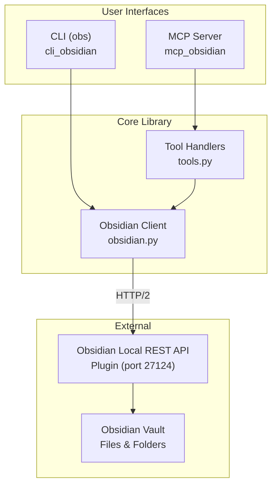
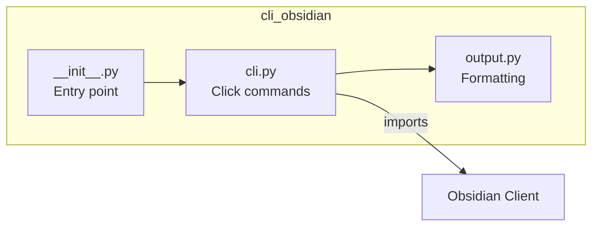
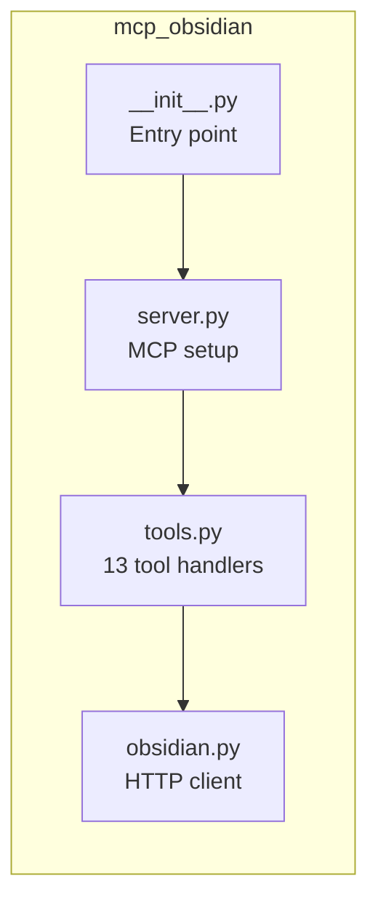
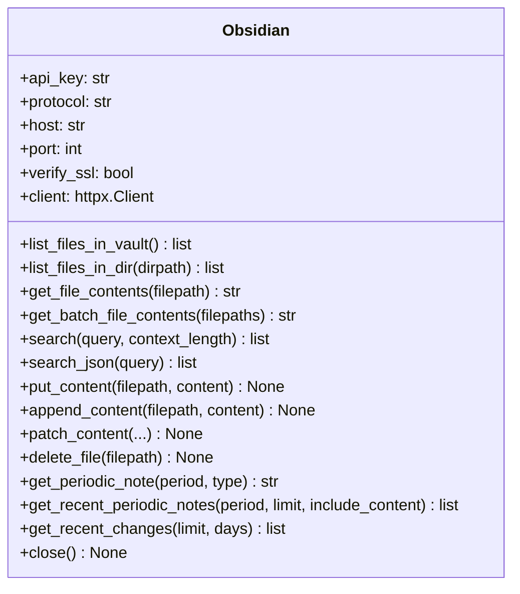
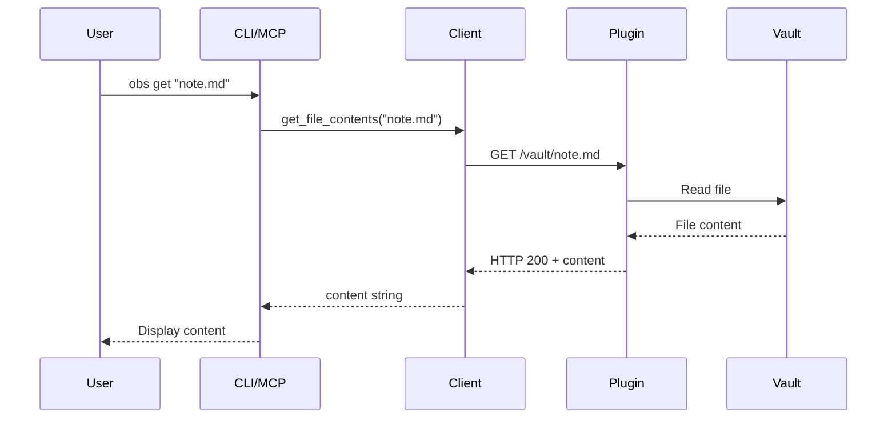
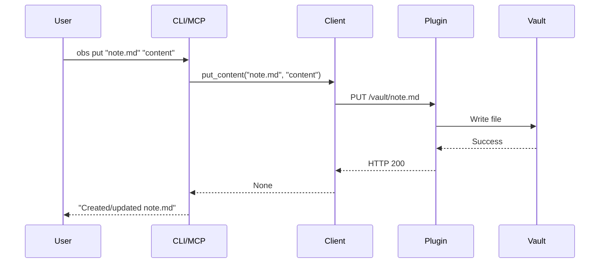
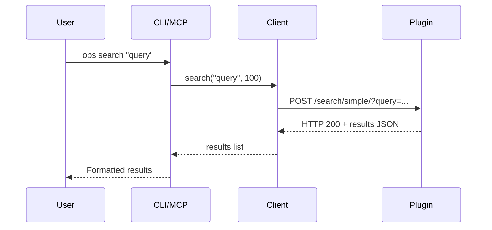
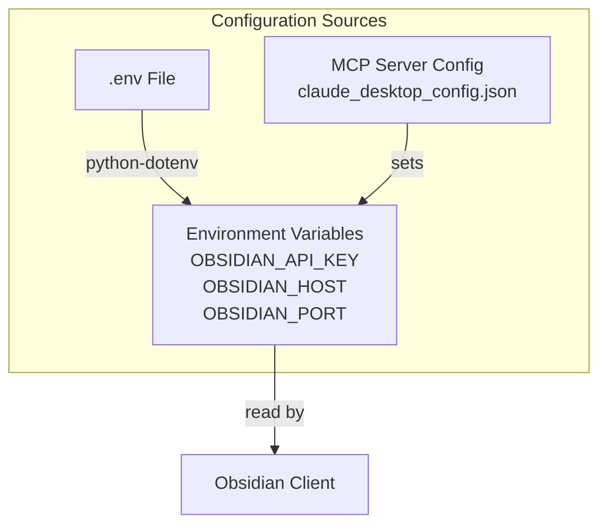
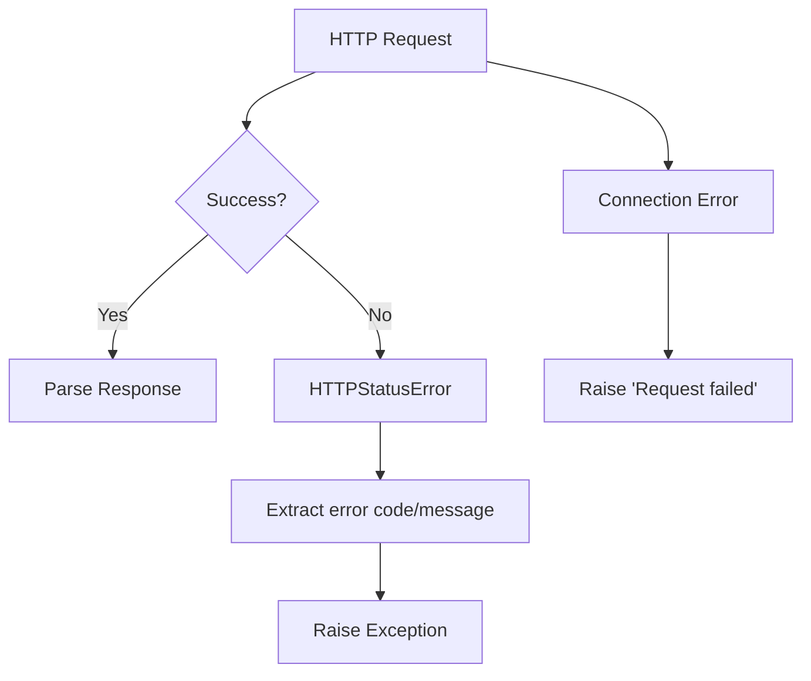

# Architecture

## System Overview



## Component Details

### CLI Package (`cli_obsidian`)



**Responsibilities:**
- Parse command-line arguments via Click
- Format output for human or JSON consumption
- Handle environment variables and configuration

**Key Files:**
- `cli.py` - 11 Click commands (list-files, get, search, etc.)
- `output.py` - Output formatting helpers (print_json, print_error, etc.)

### MCP Server Package (`mcp_obsidian`)



**Responsibilities:**
- Implement Model Context Protocol (MCP) interface
- Expose 13 tools for AI assistants
- Handle tool invocation and response formatting

**Key Files:**
- `server.py` - MCP server initialization
- `tools.py` - ToolHandler classes for each operation
- `obsidian.py` - HTTP/2 client for REST API

### Obsidian Client (`obsidian.py`)



**Features:**
- Lazy-initialized httpx.Client with HTTP/2 support
- Automatic error handling and response parsing
- Environment-based configuration

## Data Flow

### Read Operation (get file)



### Write Operation (put content)



### Search Operation



## API Endpoints

The client communicates with these Obsidian Local REST API endpoints:

| Method | Endpoint | Description |
|--------|----------|-------------|
| GET | `/vault/` | List vault root |
| GET | `/vault/{path}/` | List directory |
| GET | `/vault/{path}` | Get file content |
| PUT | `/vault/{path}` | Create/overwrite file |
| POST | `/vault/{path}` | Append to file |
| PATCH | `/vault/{path}` | Patch file content |
| DELETE | `/vault/{path}` | Delete file |
| POST | `/search/simple/` | Text search |
| POST | `/search/` | JsonLogic/DQL search |
| GET | `/periodic/{period}/` | Get periodic note |
| GET | `/periodic/{period}/recent` | List recent periodic notes |

## Configuration



## Error Handling



**Error Types:**
- `HTTPStatusError` - API returned error status (4xx, 5xx)
- `RequestError` - Connection/network failures

## Technology Stack

| Component | Technology | Purpose |
|-----------|------------|---------|
| HTTP Client | httpx 0.28+ | HTTP/2 support, modern async-capable |
| CLI Framework | Click 8.0+ | Command parsing, help generation |
| MCP Protocol | mcp 1.1.0+ | AI assistant integration |
| Configuration | python-dotenv | .env file support |
| Type Checking | basedpyright | Static type analysis |
| Linting | ruff | Fast Python linter/formatter |
| Testing | pytest | Test framework |

## Package Structure

```
mcp-obsidian/
├── src/
│   ├── mcp_obsidian/           # MCP Server Package
│   │   ├── __init__.py         # Package entry, main()
│   │   ├── server.py           # MCP server setup
│   │   ├── tools.py            # 13 ToolHandler classes
│   │   └── obsidian.py         # HTTP/2 API client
│   │
│   └── cli_obsidian/           # CLI Package
│       ├── __init__.py         # Package entry, main()
│       ├── cli.py              # 11 Click commands
│       └── output.py           # Output formatting
│
├── tests/
│   └── cli_obsidian/           # CLI tests
│       └── test_cli.py         # 23 test cases
│
├── docs/
│   ├── api-reference.md        # Python API docs
│   ├── cli-reference.md        # CLI command docs
│   └── architecture.md         # This document
│
├── pyproject.toml              # Project configuration
└── README.md                   # Project overview
```
